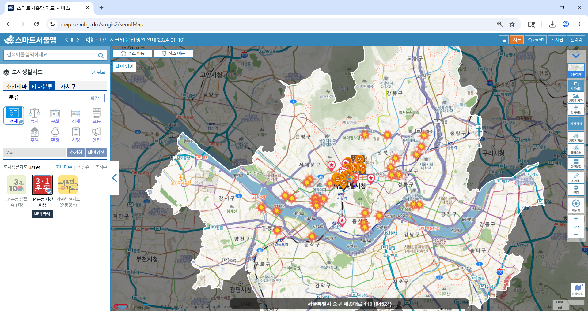
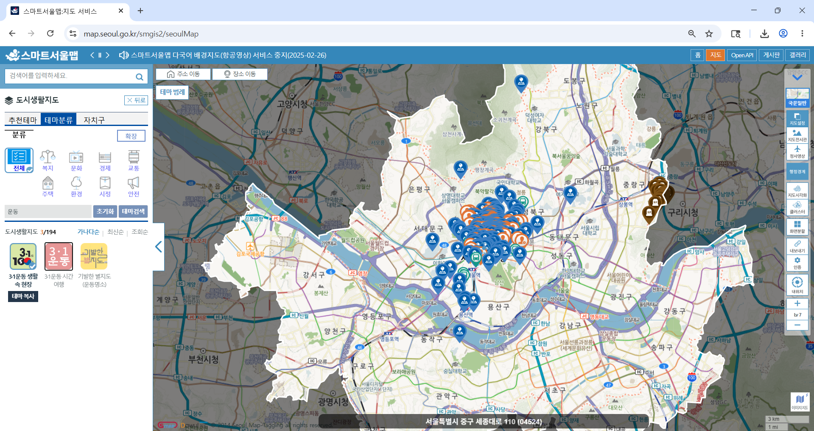
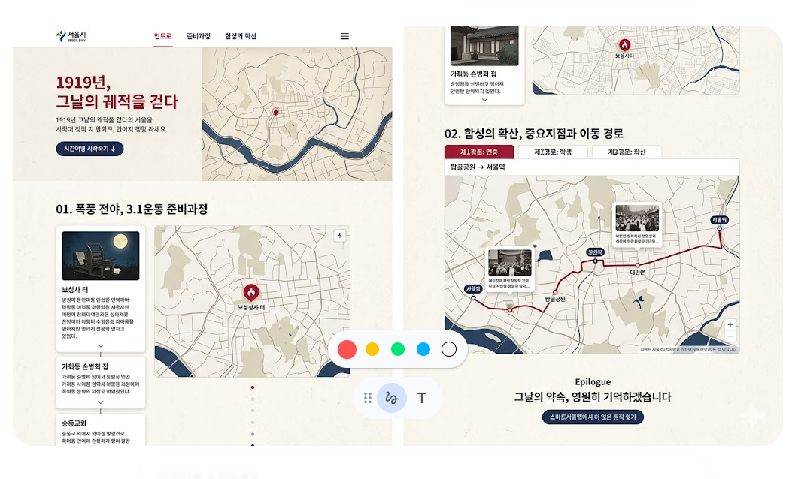
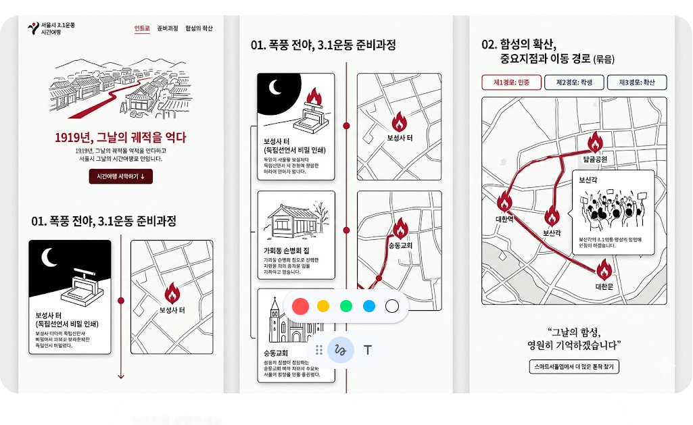
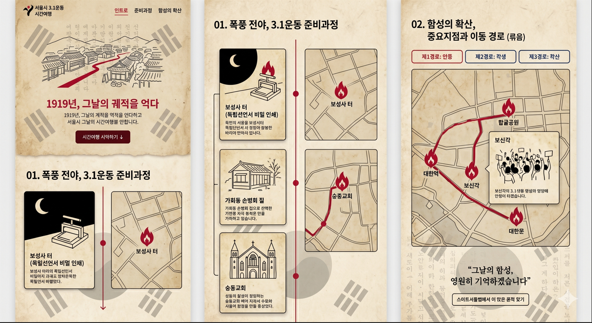

# [초안] 20260519 이진우 3.1운동

---

# 제목

- 1919년 3월 서울, 그날의 궤적을 걷다.

---

# 사용 테마

- name : 3·1운동 시간여행 (ID : 11100550)
- url : [https://map.seoul.go.kr/smgis2/themeGallery/detail?theme_id=11100550](https://map.seoul.go.kr/smgis2/themeGallery/detail?theme_id=11100550)

- name : 3·1운동 생활 속 현장 (ID : 100173)
- url : [https://map.seoul.go.kr/smgis2/themeGallery/detail?theme_id=100173](https://map.seoul.go.kr/smgis2/themeGallery/detail?theme_id=100173)

---

# 관련 페이지

- KBS NEWS 3.1운동 100년 특집: [https://samil-100.kbs.co.kr/news/desktop-main-no-skip.php](https://samil-100.kbs.co.kr/news/desktop-main-no-skip.php)
- 국사편찬위원회 삼일운동 데이터베이스: [https://hgis.history.go.kr/samil/home/main/main.do](https://hgis.history.go.kr/samil/home/main/main.do)
- 서울역사아카이브: [https://museum.seoul.go.kr/archive/NR_index.do](https://museum.seoul.go.kr/archive/NR_index.do)
- 서울역사박물관: [https://museum.seoul.go.kr/www/NR_index.do?sso=ok](https://museum.seoul.go.kr/www/NR_index.do?sso=ok)
- 서울역사편찬원: [https://history.seoul.go.kr/index.do](https://history.seoul.go.kr/index.do)

---

# 벤치마킹

- arcgis story map: [https://www.esri.com/en-us/arcgis/products/arcgis-storymaps/overview](https://www.esri.com/en-us/arcgis/products/arcgis-storymaps/overview)
- 스토리인서울: [https://www.seoul.go.kr/storyw/intro/list.do](https://www.seoul.go.kr/storyw/intro/list.do)

---

# 화면 구성 상세화

## [공통] Header (헤더 영역)

- 구성: 좌측에는 '서울특별시 스토리 in 서울' 로고를 배치하고, 우측에는 네비게이션 메뉴들을 가로로 나열합니다.

## [Section 1] 준비와 이동경로

섹션의 큰 주제는 '준비와 이동경로'로 명명하며, 사용자의 조작에 따라 두 가지 파트로 나누어 정보를 제공합니다.

1. 3.1운동 준비과정
   - 레이아웃: 화면을 좌우로 분할하여 왼쪽에는 설명 카드 영역을 두고, 오른쪽에는 지도를 화면에 고정(Sticky)시킵니다.
   - 작동 방식 (인터랙션): 사용자가 마우스 휠을 스크롤하면 왼쪽 영역에서 준비 과정을 담은 설명 카드들이 순서대로 올라옵니다. 사용자의 스크롤 위치(읽고 있는 카드)에 맞춰, 오른쪽 지도가 해당 역사적 장소로 부드럽게 이동하며 마커를 표시해 줍니다.

2. 이동경로 (컨트롤 패널 UI)
   - 레이아웃: 첨부된 두 번째 사진의 '도시생활지도' 팝업창처럼, 지도 한쪽에 경로를 선택하고 조작할 수 있는 컨트롤 패널(UI 박스)을 배치합니다.
   - 작동 방식 (인터랙션): 패널 안에는 '이동경로 서대', '이동경로 동대', '시위경로' 총 3가지의 경로가 리스트 형태로 제공됩니다. 사용자가 체크박스(또는 버튼)를 클릭해 보고 싶은 경로를 직접 켜고 끌 수 있으며, 선택한 경로들이 지도 위에 직관적인 선으로 표시됩니다. '전체 해제' 기능 등을 포함하여, 사용자가 이 3가지 경로를 겹쳐 보거나 개별적으로 보기 편하도록 제어 권한을 제공합니다.

## [Section 2] 중요 지점과 시위 장소

섹션의 큰 주제는 '중요 지점과 시위 장소'로 명명하며, 3.1운동의 핵심 거점들을 사용자가 한눈에 파악하고 위치를 확인할 수 있도록 두 가지 파트로 나누어 정보를 제공합니다.

1. 역사적 장소 안내 (카드형 리스트)
   - 레이아웃: 화면 중앙에 세로로 나열되는 리스트 형태로 배치합니다. 각 장소(예: 탑골공원, 태화관 터)는 독립된 깔끔한 카드 UI로 제공됩니다. 카드 상단에는 직관적인 아이콘과 장소명, 한 줄 요약이 들어가며, 하단에는 주소, 발생 일시, 주요 사건 등의 상세 정보가 2단 그리드 형태로 정돈되어 배치됩니다.
   - 작동 방식 (인터랙션): 사용자는 페이지를 상하로 스크롤하며 3.1운동의 주요 거점들을 마치 역사 가이드북을 보듯 편안하게 탐색할 수 있습니다. 각 장소의 핵심 정보가 구획화되어 있어 스캐닝하듯 빠르게 정보를 습득할 수 있습니다.

2. 상세 위치 확인 (지도 연동)
   - 레이아웃: 각 장소 카드 내부 우측 상단에 눈에 잘 띄는 '지도보기' 버튼을 공통으로 배치합니다.
   - 작동 방식 (인터랙션): 사용자가 특정 카드의 '지도보기' 버튼을 클릭하면, 해당 장소의 정확한 위치를 보여주는 상세 지도로 화면이 부드럽게 이동(또는 모달 팝업 오픈)하며 마커를 표시해 줍니다. 이를 통해 텍스트로 읽은 역사적 장소가 실제 현재 지도상 어디에 위치해 있는지 즉각적이고 입체적으로 연결하여 확인할 수 있습니다.

## [Section 3] 우리동네 3.1운동가

섹션의 큰 주제는 '우리동네 3.1운동가'로 명명하며, 사용자가 인물 사진을 통해 직관적으로 독립운동가들을 살펴보고 그들의 주요 활동 반경이나 연고지를 지도에서 바로 확인할 수 있도록 구성합니다.

1. 하단 인물 갤러리 (가로 스크롤 & 썸네일)
   - 레이아웃: 화면 맨 아래에 가로로 길게 스크롤 되는 인물 사진(또는 초상화/일러스트) 갤러리 영역을 배치하고 위에 큰 지도 하나를 놓습니다.
   - 작동 방식 (인터랙션): 사용자는 마우스 휠이나 좌우 스와이프(모바일)를 통해 3.1운동가들의 얼굴과 이름을 탐색할 수 있습니다. 각 인물 카드에 마우스를 올리면(Hover) 이름과 출신 동네가 간략히 표시되는 시각적 효과를 줍니다.

2. 지도 연동 및 정보 팝업
   - 레이아웃: 화면의 주된 영역(상단~중단)은 넓은 지도가 차지합니다. 인물을 클릭했을 때 지도 위에 뜨는 팝업(인포윈도우)에는 인물의 사진, 이름, 간략한 공적, 그리고 상세 정보를 볼 수 있는 '관련 URL(예: 공훈전자사료관 링크 등)' 버튼이 포함됩니다.
   - 작동 방식 (인터랙션): 하단 갤러리에서 특정 인물을 클릭하면, 첫 번째 사진(스마트서울맵)처럼 지도 상의 해당 인물 관련 장소(생가, 만세 시위 주도 장소 등)로 지도가 부드럽게 이동(줌인)하며 눈에 띄는 마커가 생성됩니다. 동시에 마커 위에 팝업창이 열리며 해당 인물의 상세한 역사적 스토리와 링크를 제공하여 깊이 있는 정보 탐색을 유도합니다.

---

# 예시화면

