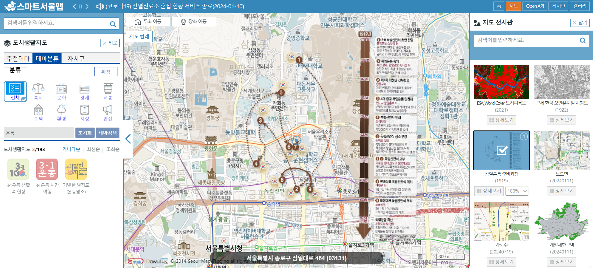
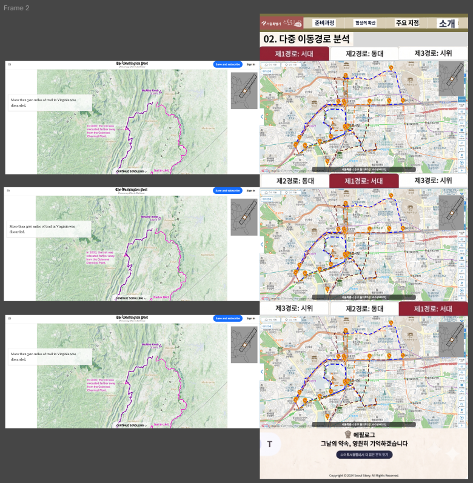
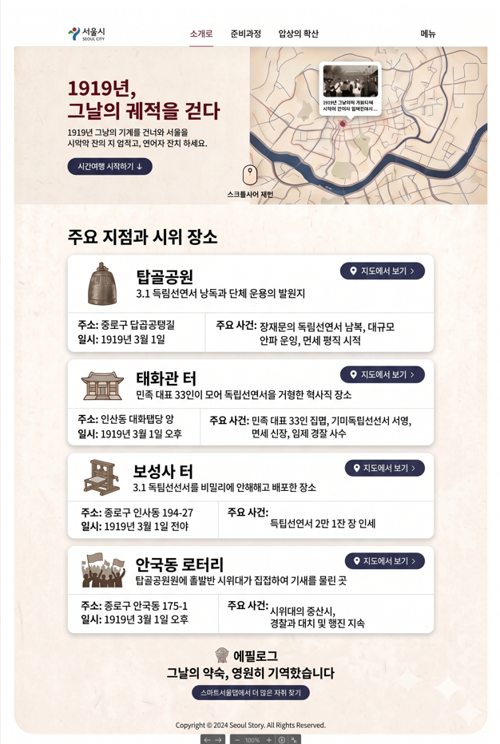
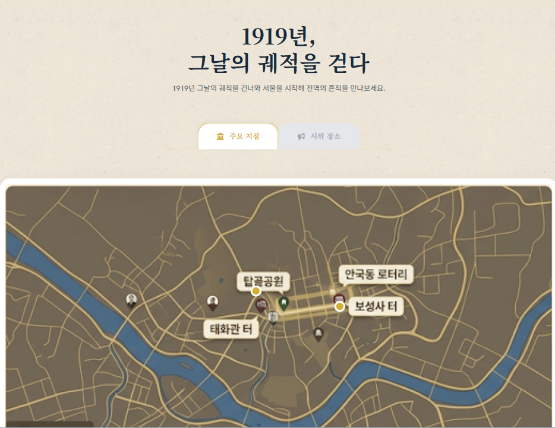
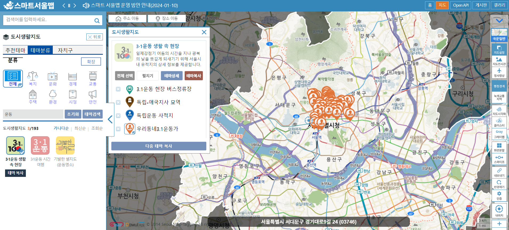
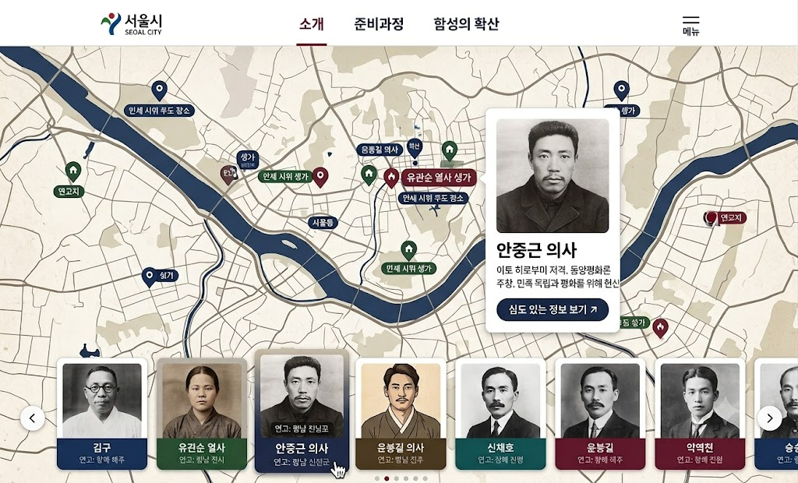
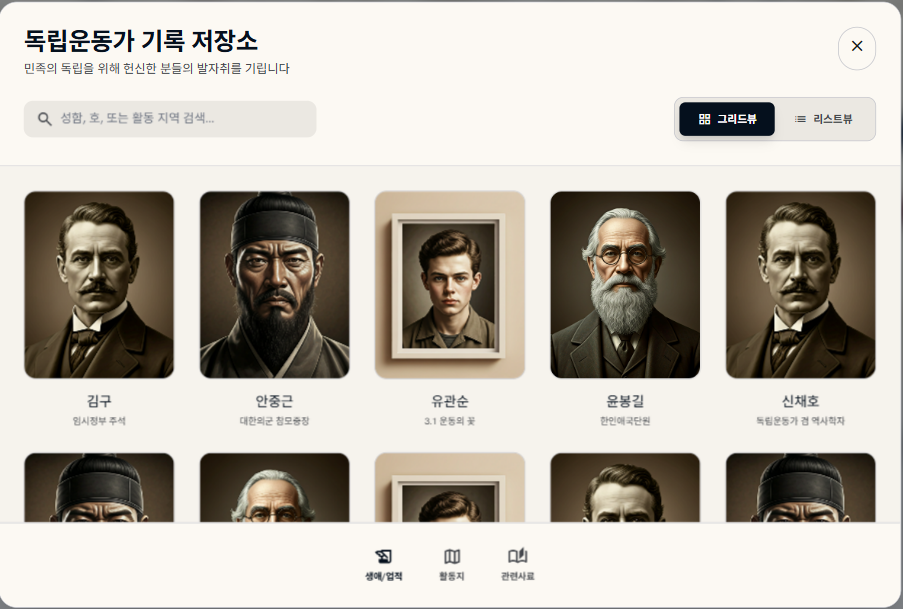
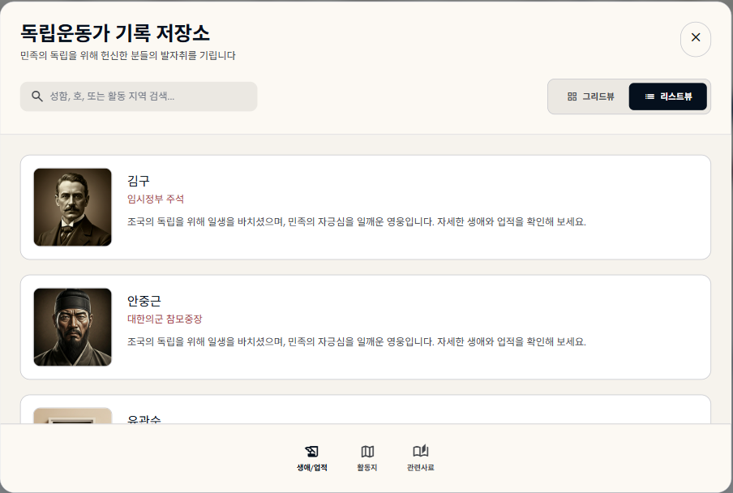
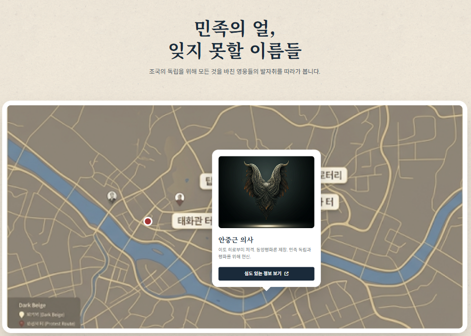

# [기획] 20260527 이진우 3.1운동 발표자료

---

# 1. Section 4개

---

## 1. [공통] Header (헤더 영역)

- 좌측(로고 영역) : ‘서울특별시 스토리 in 서울’ 로고 배치 및 클릭 시 메인 페이지로 이동하도록 링크 연결.
- 우측(내비게이션 영역) : 4개의 주요 섹션 메뉴를 담은 글로벌 내비게이션 바를 우측에 가로 형태로 일렬 배치.

---

## 2. [Section 1] 3.1운동 : 준비

### 1) Data (활용 데이터)

- 3.1운동 시간 여행 테마 - ‘3.1운동 준비’

- 지도전시관 - ‘삼일운동 준비과정’

- Seoul Solution - ‘[세미나 자료] 삼일대로 심포지엄 발표자료_6월 9일(금)’

### 2) UI/UX (화면 구조 및 기능)

- 예시자료1 : arcgis storymap - The 10 most-visited U.S. urban parks

[The 10 most-visited U.S. urban parks](https://storymaps.arcgis.com/stories/0f6f051fba32481cba12e8565e8681a0)

- 예시자료2 : arcgis storymap - Geospatial Conservation at The Nature Conservancy 2024

[Geospatial Conservation at The Nature Conservancy 2024](https://storymaps.arcgis.com/stories/0c31e7aee9514046b705fc1b54478f09)

- 예시자료3 :  arcgis storymap - Glacial Gardens

[Glacial Gardens](https://storymaps.arcgis.com/stories/9b0418371dbb4f2f9922aa0a79d34e87)

- 기본 구조 (스크롤리텔링): 화면을 좌우로 분할하여, 사용자의 스크롤 동작에 따라 텍스트와 시각 자료가 유기적으로 연동되도록 구성.
- 좌측 (서사 영역): 3.1운동 발발 전 준비 과정(비밀 회합, 독립선언서 작성 및 인쇄 등)을 시간 흐름에 따라 분절된 텍스트 설명 카드로 구성. 사용자가 마우스 휠을 아래로 스크롤함에 따라, 각 단계별 역사적 서사를 담은 카드들이 화면 하단에서 나타나도록 페이드 인 효과 적용. 현재 읽고 있는 활성화된 단계의 카드는 별도의 시각적 강조 처리를 거쳐, 사용자가 역사적 흐름을 순차적으로 파악할 수 있도록 가이드 제공.
- 우측 (시각 자료 영역): 좌측의 서사 진행 상황과 연동되는 인터랙티브 지도를 우측 화면에 고정 배치. 서울시 '지도전시관'의 삼일운동 준비 과정 데이터를 기반으로 역사적 주요 거점들을 지도 위에 매핑하고, 사건 발생 순서에 따른 번호 마커 및 이동 경로 표시. 사용자의 스크롤 위치에 맞춰 지도의 중심축이 다음 장소로 이동하며, 지도 상의 순번 마커를 클릭할 경우 해당 거점으로 화면이 줌 인 되어 상세한 장소 정보 제공.

[https://www.figma.com/proto/AVhEFHJqxURHqbgMCGVROw/1919-3%EC%9B%94-%EC%84%9C%EC%9A%B8--%EA%B7%B8%EB%82%A0%EC%9D%98-%ED%95%A8%EC%84%B1?node-id=93-832&p=f&t=46S1MaReZtzR8zEP-1&scaling=scale-down&content-scaling=fixed&page-id=88%3A2007&starting-point-node-id=93%3A832](https://www.figma.com/proto/AVhEFHJqxURHqbgMCGVROw/1919-3%EC%9B%94-%EC%84%9C%EC%9A%B8--%EA%B7%B8%EB%82%A0%EC%9D%98-%ED%95%A8%EC%84%B1?node-id=93-832&p=f&t=46S1MaReZtzR8zEP-1&scaling=scale-down&content-scaling=fixed&page-id=88%3A2007&starting-point-node-id=93%3A832)

---

## 3. [Section 2] 3.1운동 이동경로

### 1) Data (활용 데이터)

- 3.1운동 시간 여행 테마 - ‘3.1운동 이동경로’

- Seoul Solution - ‘[세미나 자료] 삼일대로 심포지엄 발표자료_6월 9일(금)’

### 2) UI/UX (화면 구조 및 기능)

- 예시자료 : arcgis storymap - Why the famed Appalachian Trail keeps getting longer - and harder

[Why the famed Appalachian Trail keeps getting longer — and harder](https://www.washingtonpost.com/history/interactive/2023/appalachian-trail-length-route-changes/)

- 레이아웃: 전체 화면으로 확장된 지도 위에 사용자가 경로 시각화 기능을 제어할 수 있는 플로팅 형태의 컨트롤 패널 구성 요소 배치. 지도 영역 내에서 화면을 이동하거나 비율을 조절할 때에도 패널이 지정된 위치에 고정되어 사용자 접근성 확보.
- 탭 메뉴 구조: 화면 상단에 '이동경로 서대', '이동경로 동대',’이동경로 동향’ 3가지 경로 데이터를 독립된 패널 항목 카테고리를 전환할 수 있는 탭 메뉴 구성. 사용자의 탭 선택에 따라 하단 카드 리스트의 출력 데이터 전환.
- 시각화 애니메이션: 사용자가 패널에서 특정 경로 항목을 선택할 경우 출발지 좌표부터 도착지 좌표를 향해 선이 순차적으로 연장되는 애니메이션 기능 적용. 경로 전체 이미지를 동시에 출력하는 방식을 배제하고 시간 흐름에 따른 위치 변화를 선형 데이터로 출력하여 이동 과정의 방향성 및 순서 정보 제공.
- 상세 정보 노출: 지도 화면에 출력된 경로 선 위로 마우스 포인터 이동 시 해당 확산 구간의 세부 데이터 노출. 구간별 이동 거리 수치, 장소 명칭, 관련 역사적 사실 등을 텍스트 박스 형태로 띄워주는 툴팁 정보 표시.

---

## 4. [Section 3] 중요 지점과 시위 장소

### 1) Data (활용 데이터)

- 3.1운동 시간 여행 테마 - ‘3.1운동 중요지점’, ‘시위장소’

### 2) UI/UX (화면 구조 및 기능) - 화면예시1

- 예시자료 : 스토리 인 서울 - 서울 봄꽃길 175선

[도시에서 즐기는 봄꽃여행. 서울, 봄꽃으로 물들다](https://www.seoul.go.kr/story/springflowerway/pc.html)

- 탭 메뉴 구조 : 화면 상단에 '시위 장소'와 '중요 지점' 2가지 카테고리를 전환할 수 있는 탭 메뉴 구성. 사용자의 탭 선택에 따라 하단 카드 리스트의 출력 데이터 전환.
- 카드 리스트 레이아웃 : 화면 중앙에 세로형 리스트 형태로 독립된 카드 UI 배치.
    - 카드 상단부 : 아이콘, 장소명, 한 줄 요약 텍스트 배치.
    - 카드 하단부 : 상세 주소, 발생 일시, 주요 사건 등의 데이터를 2단 그리드 시스템으로 정렬하여 정보 제공.
- 카드 리스트 인터랙션 : 스크롤 다운 시 각 장소 카드가 화면 하단에서 나타나는 트랜지션효과 적용. 정보의 구획화를 통해 사용자의 빠른 텍스트 스캐닝 지원.
- 지도 팝업 레이아웃 : 각 장소 카드의 우측 상단 또는 하단 영역에 '지도에서 보기' CTA 버튼 공통 배치.
- 지도 팝업 인터랙션 : 해당 버튼 클릭 시 상세 지도를 모달 팝업 형태로 화면 중앙에 출력. 팝업 활성화와 동시에 지도 화면이 해당 장소의 위치 좌표로 줌 인 되며 마커 애니메이션 재생. 역사적 장소의 현재 위치 데이터 연동 및 시각화 제공.

### 3) UI/UX (화면 구조 및 기능) - 화면예시2

- 예시자료 : openlayers - ‘custom animation’

[Custom Animation](https://openlayers.org/en/latest/examples/feature-animation.html)

- 헤더 및 탭 메뉴 구조 : 화면 중앙 상단에 메인 타이틀 텍스트 배치 후, 그 하단에 '주요 지점'과 '시위 장소' 2가지 카테고리를 전환할 수 있는 버튼형 탭 메뉴 구성.
- 지도 마커 및 라벨 배치 : 지도 화면 위에 '탑골공원', '태화관 터', '보성사터', '안국동 로터리' 등 핵심 역사적 장소의 위치를 텍스트 라벨이 결합된 핀 마커 형태로 직관적으로 표시.
- 지도 영역 인터랙션 : 사용자의 상단 탭 선택('주요 지점' 또는 '시위 장소')에 따라 지도에 출력되는 마커, 아이콘이 해당 카테고리에 맞춰 동적으로 페이드인/아웃되며 전환되는 효과 적용.
- 마커 클릭 인터랙션 및 팝업 출력 : 지도 화면 위에 표시된 핀 마커를 클릭하면, 지도 화면 위에 해당 장소의 상세 정보를 담은 독립된 카드 형태의 정보 팝업창이 오버레이 되어 나타남.

---

## 5. [Section 4] 우리동네 3.1 운동가

### 1) Data (활용 데이터)

- 3.1운동 생활 속 현장 테마 - ‘우리동네 3.1운동가’

- 한국 근대 사료 DB - 일제감시대상인물카드

[일제감시대상인물카드 <
	
		
		
	
	한국 근대 사료 DB](https://db.history.go.kr/modern/ia/level.do)

### 2) UI/UX (화면 구조 및 기능) - 화면예시1

- 예시자료 : 구글지도 - 탐색

[Google Maps](https://www.google.com/maps/?entry=ttu&g_ep=EgoyMDI2MDUyMC4wIKXMDSoASAFQAw%3D%3D)

- 인물 갤러리 레이아웃: 화면 중단 메인 영역에 전체 화면 지도를 배치하고, 화면 최하단에 가로형 캐러셀구조의 인물 썸네일 갤러리 배치. 독립운동가의 사진, 초상화, 일러스트 등을 규격화된 썸네일 카드 형태로 나열.
- 갤러리 인터랙션: 마우스 휠 스크롤 및 모바일 환경의 좌우 스와이프 제스처를 통한 썸네일 탐색 기능 지원. 특정 인물 카드에 마우스 클릭 시, 시각적 효과적용 및 인물명, 연고지 정보가 텍스트 오버레이 형태로 노출.
- 지도 및 팝업 레이아웃: 메인 지도 영역과 하단 인물 갤러리의 데이터 연동. 지도 상에 출력되는 인포윈도우 팝업 내에 인물 사진, 이름, 공적 요약 정보 배치. 팝업 하단에 공훈전자사료관 등 외부 상세 정보 페이지로 연결되는 CTA 버튼 구성.
- 지도 연동 인터랙션: 하단 갤러리에서 특정 인물 썸네일 클릭 시, 지도 중심축이 해당 인물의 주요 역사적 장소 위치 좌표로 이동 및 줌 인 처리. 좌표 이동 완료 시 해당 위치에 커스텀 마커 생성 및 인포윈도우 팝업 활성화.

### 3) UI/UX (화면 구조 및 기능) - 화면예시2

- 예시자료 : yes24 - 서적

[예스24](https://www.yes24.com/product/search?query=%25EC%25A0%2595%25EB%25B3%25B4%25EC%25B2%2598%25EB%25A6%25AC%25EA%25B8%25B0%25EC%2582%25AC&domain=ALL&page=1&viewMode=list)

- 검색 영역 레이아웃 및 인터랙션 : 상단 헤더 하단 좌측에 인물 성함, 호, 활동 지역 등을 입력하여 원하는 정보를 찾을 수 있는 검색창 배치. 우측에는 '그리드뷰'와 '리스트뷰' 버튼을 토글 형태로 구성하여, 사용자의 클릭에 따라 하단 인물 리스트의 출력 레이아웃이 즉각적으로 전환되는 인터랙션 제공.
- 그리드뷰레이아웃 : '그리드뷰' 활성화 시, 인물의 초상화(또는 이미지)를 강조한 정방형 비율의 카드를 다단 그리드 형태로 나열. 카드 하단에는 인물명과 주요 직책(예: 임시정부 주석)을 간결하게 중앙 정렬로 텍스트 배치.
- 리스트뷰 레이아웃 : '리스트뷰' 활성화 시, 가로로 긴 직사각형 형태의 카드 리스트로 레이아웃 전환. 카드의 좌측에는 썸네일 이미지를, 우측에는 인물명, 그리고 생애 및 업적에 대한 요약 설명 텍스트를 배치. 세로 스크롤을 통해 개별 인물에 대한 구체적인 텍스트 정보를 상세하게 읽을 수 있도록 지원.

### 4) UI/UX (화면 구조 및 기능) - 화면예시3

- 지도 레이아웃 : 화면 중앙에 화면의 상당 부분을 차지하는 대형 지도 배치.
- 지도 마커 배치 및 인터랙션 : 지도 위에 역사적 인물를 나타내는 마커를 배치하여 위치 정보를 직관적으로 시각화. 특정 인물 또는 장소 마커를 클릭하면, 해당 좌표를 가리키는 말풍선 형태의 인포윈도우 팝업창이 지도 위에 오버레이 되어 나타나는 인터랙션 적용.
- 정보 팝업창 상단 레이아웃 : 활성화된 팝업창 내부 상단에는 해당 인물이나 사건을 상징하는 시각적 이미지(일러스트 또는 사진)를 카드 너비에 맞춰 꽉 차게 배치하여 시각적 임팩트 제공. 이미지 바로 하단에는 인물명(예: 안중근 의사)과 주요 업적을 요약한 텍스트를 좌측 정렬로 간결하게 배치.
- 정보 팝업창 하단 레이아웃 : 팝업창 최하단에 '심도 있는 정보 보기'라는 CTA 버튼을 공통으로 배치. 사용자가 요약 정보를 확인한 후, 클릭 한 번으로 상세 페이지나 관련 사료로 이동.

---

---

# 2. Section 1개

- 예시자료 : arcgis - The two Koreas

[The Two Koreas](https://storymaps.arcgis.com/stories/2f952e57606b4caaa0a557218756cc38)

- 예시 버전

[3.1movement.html](./3.1movement.html)

---

## 00) Prologue — 3·1운동과 서울

- 메인 타이틀, 날짜, 시대 도입
- 구현: 어두운 배경 전체화면 + 큰 제목 중심 구성
- 애니메이션: 텍스트 아래서 위로 등장, 링 장식 회전, 스크롤 유도 화살표 깜빡임

---

## 01) 배경 — 일제강점기의 통치 구조

- 1910년 한일병합 / 헌병경찰제 / 언론·집회 금지
- 고종 황제 사망과 독살 의혹
- 윌슨 민족자결주의 / 독립운동 조직화
- 윌슨 인물 사진 카드
- 구현: 좌우 분할 (텍스트 + 배경 지도), Leaflet 참고
- 애니메이션: 스크롤 시 텍스트·인용구 순차 등

---

## 02-1) 준비 — 3.1운 준비: 종교 연합과 선언서 인쇄

- 2·8 독립선언 (도쿄 유학생 600명)
- 천도교·기독교·불교 3교 연합 / 민족대표 33인
- 대중화·일원화·비폭력 3원칙
- 독립선언서 21,000매 인쇄 (보성사)
- 인물 카드: 손병희 / 이승훈 / 한용운
- 구현: 좌우 분할 (텍스트 + 독립선언서 원문 표시), 한지 배경
- 애니메이션: 스크롤 시 텍스트·인물 카드 순차 등장

## 02-2) 발자취 — 타임라인

- 1919.01.20 손병희 독립운동 동의
- 1919.02.08 2·8 독립선언 (도쿄)
- 1919.02.24 3교 합작 합의
- 1919.02.27 독립선언서 21,000매 인쇄
- 1919.03.01 태화관·탑골공원 거사
- 1919.03.05 남대문역 1만 명 시위
- 1919.03.22 종로 상가 전면 철시
- 1919.04.23 한성정부 선포
- **구현:** 세로 중앙선 기준 좌우 교차 배치, 날짜 배지 + 카드, 카테고리별 색상 구분
- **애니메이션:** 스크롤 시 카드 순차 등장, 클릭 시 설명 펼침 (토글)

---

## 03) 거사 — 1919년 3월 1일, 오후 2시

- 태화관 민족대표 33인 선언식 (오후 2시)
- 탑골공원 정재용 독립선언서 낭독
- 태극기 들고 서울 시내 행진
- 인용구: "대한 독립 만세!"
- 구현: 좌우 분할 (텍스트 + 서울 시위 경로 지도), Leaflet 참고
- 애니메이션: 스크롤 시 텍스트 등장, 지도 위 경로선 그려지듯 등장

---

## 04-1) 확산과 탄압 — 시위 확산과 일제의 탄압

- 서울 시위 장소
- 마커 클릭 시 장소명·설명 팝업
- 구현: 전체화면 지도 (다크 배경), Leaflet 참고
- 애니메이션: 화면 진입 시 마커 0.4초 간격으로 등장

## 04-2) 서울 시위 지도 — 만세의 물결

- 서울 중요 장소
- 마커 클릭 시 장소명·설명 팝업
- 구현: 전체화면 지도 (다크 배경), Leaflet 참고
- 애니메이션: 화면 진입 시 마커 0.4초 간격으로 등장

---

## 05) 역사를 만든 사람들

- 구현: 그리드 인물 카드, 왼쪽 색상 선으로 역할 구분
- 애니메이션: 스크롤 시 카드 순차 등장

---

## 06) Outro — 3·1운동의 역사적 의의

- 대한민국 임시정부 수립 (1919.04 상하이)
- 무단통치 → 문화통치 전환
- 중국 5·4운동·인도 비폭력운동 등 아시아 독립운동에 영향
- 대한민국 헌법 전문에 건국 정신으로 명시
- 수치 블록: 시위 지역 1,542 / 참가 인원 200만+ / 민족대표 33
- 구현: 대형 글자 "대한독립만세" + 통계 수치 블록
- 애니메이션: 텍스트 순차 등장, 배경 그라데이션